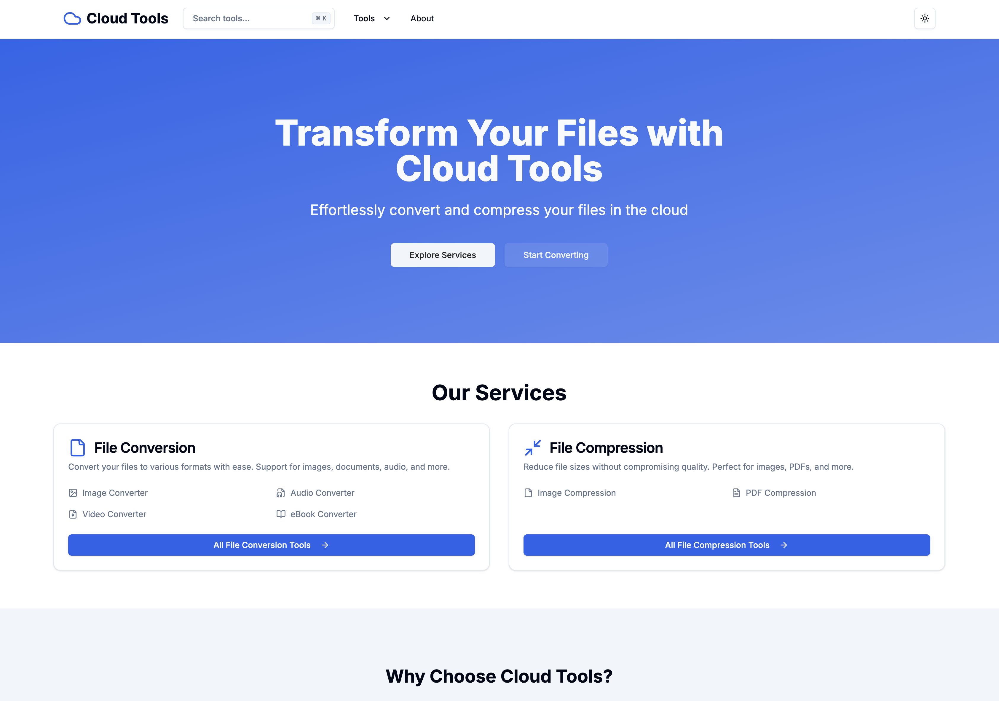
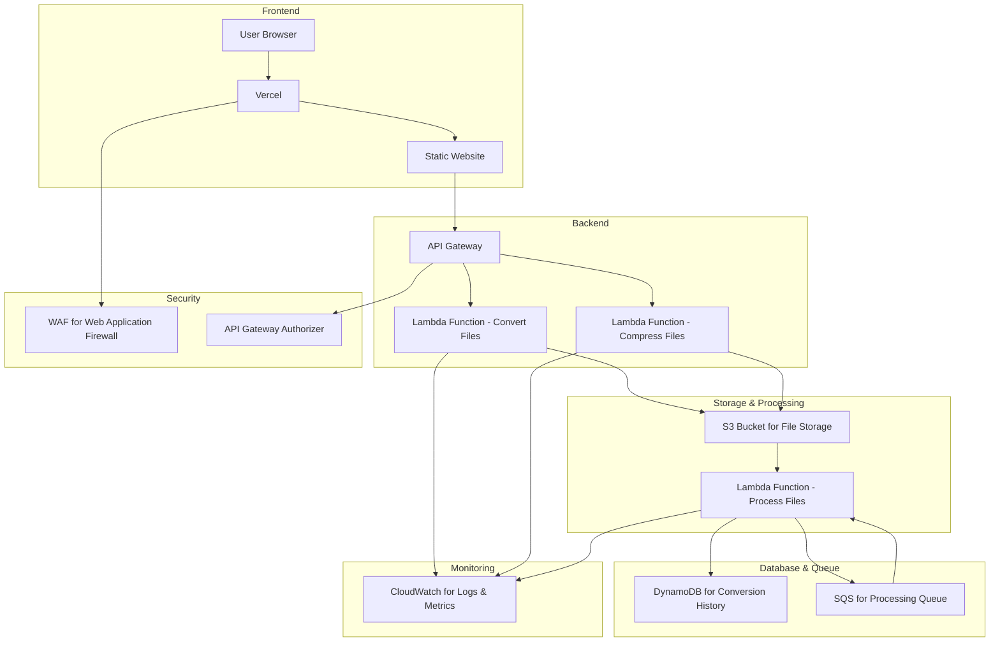

# ☁️ Cloud Tools


## 🚀 Build Status

[](https://github.com/nicholasadamou/cloud-tools/actions/workflows/ci.yml)
[](https://github.com/nicholasadamou/cloud-tools/actions/workflows/test.yml)
[](https://github.com/nicholasadamou/cloud-tools/actions/workflows/coverage.yml)
[](https://github.com/nicholasadamou/cloud-tools/actions/workflows/test-environments.yml)
[](https://github.com/nicholasadamou/cloud-tools/actions/workflows/shellcheck.yml)



_Cloud Tools_ is a AWS cloud-based service that provides users with a platform to convert or compress files.

## Why Did I Build _Cloud Tools_?

I am eager to apply my Amazon AWS knowledge to a real-world project, as this endeavor will not only reinforce my understanding of AWS services but also provide a tangible showcase of my skills in designing and implementing cloud-based solutions. By building **Cloud Tools**, I aim to demonstrate my ability to architect scalable, efficient, and secure systems. This project will highlight the practical application of the concepts I've learned, particularly in distributed systems and system design, which I have been studying extensively for both interviews and personal growth. Through this initiative, I can effectively illustrate my capacity to translate theoretical knowledge into practical, impactful solutions.

## System Architecture



### Explanation:

1. **Frontend**:
   - **User Browser**: The client-side interface where users interact with the application.
   - **Vercel**: Hosts and deploys the static website, providing fast and reliable content delivery.
   - **Static Website**: The frontend application, including HTML, CSS, and JavaScript files, is hosted on Vercel.

2. **Backend**:
   - **API Gateway**: Acts as the entry point for API requests from the frontend. It routes requests to appropriate Lambda functions.
   - **Lambda Functions**:
     - **Convert Files**: Handles file conversion tasks.
     - **Compress Files**: Handles file compression tasks.

3. **Storage & Processing**:
   - **S3 Bucket for File Storage**: Stores uploaded files temporarily during processing.
   - **Lambda Function - Process Files**: Further processes files, like storing results or updating status.

4. **Database & Queue**:
   - **DynamoDB for Conversion History**: Stores metadata about file conversions and compressions for history tracking.
   - **SQS for Processing Queue**: Manages file processing tasks asynchronously to handle high loads efficiently.

5. **Monitoring**:
   - **CloudWatch for Logs & Metrics**: Monitors application performance, logs, and metrics for Lambda functions and other AWS services.

6. **Security**:
   - **WAF for Web Application Firewall**: Protects the application from common web exploits.
   - **API Gateway Authorizer**: Handles authentication and authorization for API requests, ensuring secure access to backend services.

This architecture leverages Vercel for hosting the frontend, providing seamless integration for deploying static sites, while utilizing AWS's serverless infrastructure for backend processing, ensuring scalability and security.

## 📚 Documentation

This project includes several documentation files to help you get started and contribute:

| Document                                           | Description                                                               |
| -------------------------------------------------- | ------------------------------------------------------------------------- |
| **[QUICK_SETUP.md](../docs/QUICK_SETUP.md)**       | **🚀 Start here!** One-command setup guide to get running in 5 minutes    |
| **[INFRASTRUCTURE.md](../docs/INFRASTRUCTURE.md)** | **🏗️ AWS Infrastructure** - Complete Terraform setup and deployment guide |
| **[WORKER_SETUP.md](../docs/WORKER_SETUP.md)**     | File processing worker setup and troubleshooting                          |
| **[ACT_USAGE.md](../docs/ACT_USAGE.md)**           | **⚡ Run GitHub Actions locally** - Complete ACT setup and usage guide    |
| **[CONTRIBUTING.md](./CONTRIBUTING.md)**           | Complete contributor guide with development workflow                      |
| **README.md**                                      | This file - project overview and architecture                             |

## 🚀 Quick Start

**New here? Get running in 5 minutes:**
👉 **[QUICK_SETUP.md](../docs/QUICK_SETUP.md)** 👈

```bash
pnpm run setup  # One command setup!
pnpm run dev    # Start developing
```

## Getting Started

This is a [Next.js](https://nextjs.org) project bootstrapped with [`create-next-app`](https://nextjs.org/docs/app/api-reference/cli/create-next-app).

For detailed setup instructions, see **[QUICK_SETUP.md](../docs/QUICK_SETUP.md)**.

### Development Workflow

```bash
pnpm run dev
# or
yarn dev
# or
npm run dev
# or
bun dev
```

Open [http://localhost:3000](http://localhost:3000) with your browser to see the result.

You can start editing the page by modifying `app/page.tsx`. The page auto-updates as you edit the file.

### File Processing

To enable file conversion and compression features, you'll need to run the processing worker:

```bash
pnpm run worker  # Start the file processing worker
```

For complete worker setup instructions, see **[WORKER_SETUP.md](../docs/WORKER_SETUP.md)**.

This project uses [`next/font`](https://nextjs.org/docs/app/building-your-application/optimizing/fonts) to automatically optimize and load [Geist](https://vercel.com/font), a new font family for Vercel.

## Learn More

To learn more about Next.js, take a look at the following resources:

- [Next.js Documentation](https://nextjs.org/docs) - learn about Next.js features and API.
- [Learn Next.js](https://nextjs.org/learn) - an interactive Next.js tutorial.

You can check out [the Next.js GitHub repository](https://github.com/vercel/next.js) - your feedback and contributions are welcome!

## Run AWS infrastructure locally (LocalStack)

You can emulate most of the AWS services used by this project locally with [LocalStack]. This is helpful for fast iteration without an AWS account or incurring costs.

### What you get locally

- S3 for temporary file storage
- SQS for async processing
- DynamoDB for job/history tracking
- CloudWatch Logs (basic)
- Lambda emulation (optional; see notes)

### Prerequisites

- Docker Desktop 4.x+
- AWS CLI v2
- Node.js and pnpm/yarn for the Next.js app

### Start LocalStack

1. Start the LocalStack container from the project root:

   ```bash
   docker compose up -d
   # or: docker-compose up -d (older Docker)
   ```

   This exposes the LocalStack edge endpoint on http://localhost:4566.

2. (Optional) If you want LocalStack to auto-create resources on boot, place init scripts in the ./.localstack folder (mounted to /etc/localstack/init/ready.d). Scripts in that folder will run once LocalStack is ready.

### Configure AWS CLI to use LocalStack

LocalStack accepts any credentials by default. You can use a dedicated profile:

```bash
aws configure --profile localstack
# AWS Access Key ID [None]: test
# AWS Secret Access Key [None]: test
# Default region name [None]: us-east-1
# Default output format [None]: json
```

Set an environment variable for convenience:

```bash
export AWS_PROFILE=localstack
export AWS_DEFAULT_REGION=us-east-1
export LOCALSTACK_URL=http://localhost:4566
```

### Create example resources locally

You can adjust names to your preference; the values below match .env.local.example:

- S3 bucket:

```bash
aws --endpoint-url=$LOCALSTACK_URL s3 mb s3://cloud-tools-local-bucket
```

- DynamoDB table:

```bash
aws --endpoint-url=$LOCALSTACK_URL dynamodb create-table \
  --table-name CloudToolsJobs \
  --attribute-definitions AttributeName=jobId,AttributeType=S \
  --key-schema AttributeName=jobId,KeyType=HASH \
  --billing-mode PAY_PER_REQUEST
```

- SQS queue:

```bash
aws --endpoint-url=$LOCALSTACK_URL sqs create-queue --queue-name cloud-tools-jobs-queue
```

### Wire the Next.js app to LocalStack

1. Copy the example env file and edit as needed:
   ```bash
   cp .env.local.example .env.local
   ```
2. Run the dev server:
   ```bash
   pnpm dev
   # or npm run dev / yarn dev / bun dev
   ```

If or when you add AWS SDK usage in the app/backend, point the SDK to the LocalStack endpoints using the variables above (for AWS SDK v3, pass endpoint or use environment variables).

### Lambda emulation notes

- LocalStack can run Lambdas in multiple modes. For simple Node.js handlers, you can use the default Docker-based executor. Packaging and deploying Lambdas typically involves tools like AWS SAM or Serverless Framework. Both can target LocalStack.
- If you plan to introduce real backend logic, consider using one of:
  - Serverless Framework + serverless-offline (for local HTTP) and/or LocalStack integration
  - AWS SAM CLI with `sam local start-api` and LocalStack

[LocalStack]: https://docs.localstack.cloud/

## Deploy on Vercel

The easiest way to deploy your Next.js app is to use the [Vercel Platform](https://vercel.com/new?utm_medium=default-template&filter=next.js&utm_source=create-next-app&utm_campaign=create-next-app-readme) from the creators of Next.js.

Check out our [Next.js deployment documentation](https://nextjs.org/docs/app/building-your-application/deploying) for more details.
