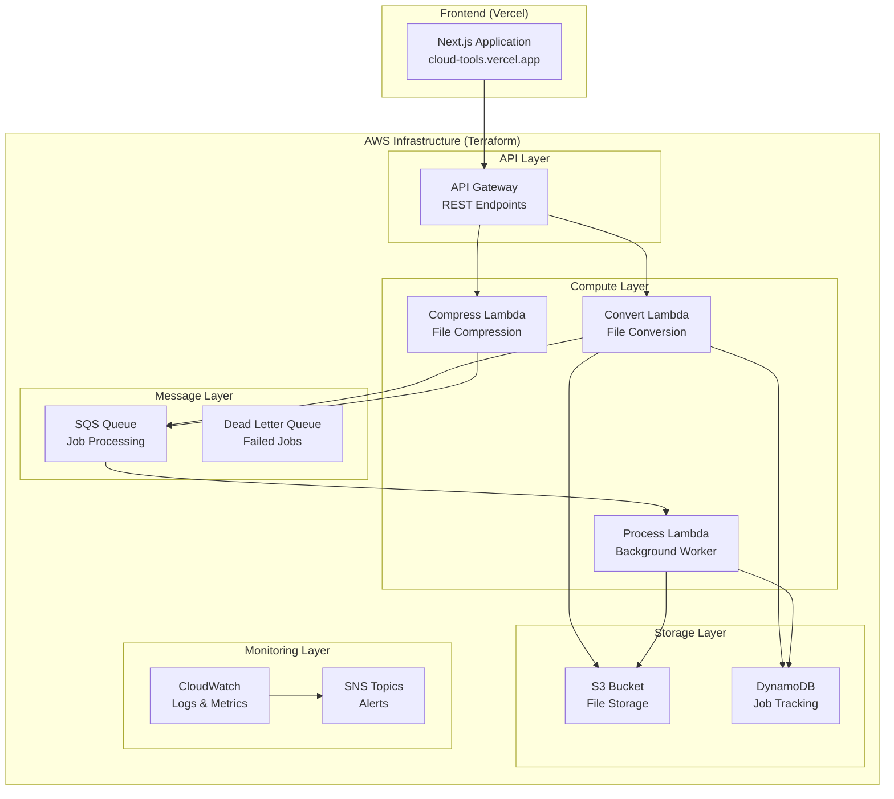

# 🏗️ Cloud Tools Infrastructure

> **Complete Terraform infrastructure for the Cloud Tools file processing platform**

### 🌟 Key Features

- ✅ **Complete AWS Infrastructure**: S3, DynamoDB, SQS, Lambda, API Gateway, CloudWatch
- ✅ **Multi-Environment Support**: Separate configurations for dev, staging, and production
- ✅ **Security Best Practices**: IAM roles with least privilege, encryption, WAF
- ✅ **Cost Optimization**: Intelligent tiering, pay-per-request billing, automated cleanup
- ✅ **Monitoring & Alerting**: CloudWatch dashboards, alarms, budget notifications
- ✅ **Infrastructure as Code**: Version-controlled, repeatable deployments
- ✅ **Automated Deployment**: Scripts and documentation for easy setup

## 📁 New Infrastructure Structure

```
cloud-tools/
├── client/                     # 🖥️ Next.js web application (@cloud-tools/client)
│   ├── app/                   # Next.js app directory
│   ├── components/            # React components
│   └── lib/                   # Client-specific utilities
├── infrastructure/             # 🏗️ Terraform and Lambda functions
│   ├── modules/
│   │   └── lambda/src/         # 📦 Lambda workspace (@cloud-tools/lambda)
│   │       ├── handlers/      # Lambda function handlers
│   │       ├── adapters/      # AWS service adapters
│   │       └── tsconfig.json  # Lambda TypeScript config
│   └── environments/          # Environment-specific configs
│       ├── dev/               # Development environment
│       ├── staging/           # Staging environment
│       └── production/        # Production environment
├── terraform/                  # 🆕 Complete Terraform infrastructure
│   ├── README.md              # Detailed infrastructure docs
│   ├── main.tf                # Main configuration
│   ├── variables.tf           # Global variables
│   ├── outputs.tf             # Infrastructure outputs
│   ├── modules/               # Reusable Terraform modules
│   │   ├── s3/                # File storage
│   │   ├── dynamodb/          # Job tracking
│   │   ├── sqs/               # Message queues
│   │   ├── lambda/            # Processing functions
│   │   ├── api-gateway/       # REST API
│   │   ├── cloudwatch/        # Monitoring
│   │   └── iam/               # Security & permissions
│   └── scripts/               # Deployment utilities
│       └── deploy.sh          # Automated deployment
├── lib/                       # 📚 Shared libraries and utilities
│   ├── aws-config.ts         # AWS configuration
│   └── worker.ts             # File processing logic
├── docs/                      # 📖 Documentation
├── scripts/                   # 🔧 Development scripts
├── pnpm-workspace.yaml        # PNPM workspace configuration
└── ... (config files)
```

## 🚀 Quick Infrastructure Deployment

### Prerequisites

1. **AWS CLI** configured with admin permissions
2. **Terraform** >= 1.0 installed
3. **Basic AWS knowledge** (S3, Lambda, etc.)

### 1️⃣ Setup Backend (One-time)

```bash
# Create S3 bucket for Terraform state
aws s3 mb s3://cloud-tools-terraform-state-dev

# Create DynamoDB table for state locking
aws dynamodb create-table \
  --table-name cloud-tools-terraform-locks-dev \
  --attribute-definitions AttributeName=LockID,AttributeType=S \
  --key-schema AttributeName=LockID,KeyType=HASH \
  --provisioned-throughput ReadCapacityUnits=1,WriteCapacityUnits=1
```

### 2️⃣ Deploy Infrastructure

```bash
# Navigate to terraform directory
cd terraform

# Deploy development environment
./scripts/deploy.sh -e dev -a plan    # Review changes
./scripts/deploy.sh -e dev -a apply   # Deploy infrastructure

# Deploy production environment
./scripts/deploy.sh -e production -a plan
./scripts/deploy.sh -e production -a apply
```

### 3️⃣ Get Deployment Info

```bash
# Get API Gateway URL and other outputs
cd terraform/environments/dev
terraform output

# Example output:
# api_gateway_url = "https://abc123.execute-api.us-east-1.amazonaws.com/dev"
# s3_bucket_name = "cloud-tools-dev-a1b2c3d4"
# dynamodb_table_name = "CloudToolsJobs-dev-a1b2c3d4"
```

## 🏗️ Infrastructure Architecture

The Terraform configuration creates a complete serverless architecture:



## 🌍 Environment Configuration

### Development Environment

- **Purpose**: Local development and testing
- **Cost**: ~$5-10/month
- **Features**: Basic monitoring, localhost CORS, reduced retention
- **Security**: Relaxed (no WAF, simplified policies)

### Production Environment

- **Purpose**: Live application workloads
- **Cost**: ~$20-100/month (usage-based)
- **Features**: Full monitoring, alerting, backups, enhanced security
- **Security**: Hardened (WAF enabled, strict CORS, comprehensive logging)

## 💡 Integration with Existing Project

The infrastructure is designed to work seamlessly with your existing Next.js application:

### 1. Update Environment Variables

After deployment, update your `.env.local`:

```bash
# Get infrastructure outputs
cd terraform/environments/dev
terraform output -json > ../../../infrastructure-outputs.json

# Update your .env.local with the outputs
AWS_REGION=us-east-1
S3_BUCKET_NAME=cloud-tools-dev-a1b2c3d4
DDB_TABLE_NAME=CloudToolsJobs-dev-a1b2c3d4
SQS_QUEUE_URL=https://sqs.us-east-1.amazonaws.com/123456789012/cloud-tools-jobs-queue-dev-a1b2c3d4
API_GATEWAY_URL=https://abc123.execute-api.us-east-1.amazonaws.com/dev
```

### 2. Lambda Functions - Full TypeScript Integration

The Terraform configuration includes **production-ready Lambda functions** with complete TypeScript integration using your existing worker logic:

**✅ What's Included:**

- **Real Processing Logic**: Direct integration with your `lib/worker.ts` processors
- **Automated Build**: TypeScript compilation with esbuild bundling
- **AWS SDK v3**: Optimized Lambda implementations for S3, DynamoDB, SQS
- **Error Handling**: Production-ready error handling and logging
- **Auto-deployment**: Functions are built and deployed automatically by Terraform

**🔧 Build Process:**

```bash
# Lambda functions are automatically built during terraform apply
# The build process:
# 1. Compiles TypeScript handlers with esbuild
# 2. Bundles with your worker processors (Sharp, FFmpeg, PDF-lib)
# 3. Creates optimized deployment packages
# 4. Installs production dependencies
# 5. Creates ZIP packages for Lambda deployment

# Manual build (if needed):
cd terraform/modules/lambda
./build.sh
```

**📁 Lambda Function Architecture:**

- **`convert.ts`**: API Gateway handler for synchronous file conversion
  - Integrates with `SharpImageConverter`, `FFmpegVideoConverter`, `PDFCompressor`
  - Handles CORS, error responses, job status updates
  - Returns immediate results for API Gateway integration

- **`compress.ts`**: API Gateway handler for file compression
  - Uses your existing compression algorithms and settings
  - Supports all formats from your worker implementation
  - Provides compression ratio and file size reports

- **`process.ts`**: SQS message handler for background processing
  - Processes long-running jobs asynchronously
  - Handles retry logic and dead letter queue integration
  - Uses your complete processor pipeline

- **`aws-lambda-adapter.ts`**: AWS service implementations optimized for Lambda
  - `LambdaS3FileStorage`: S3 operations with your existing interface
  - `LambdaSqsMessageQueue`: SQS polling and message management
  - `LambdaJobStatusUpdater`: DynamoDB job tracking with your schema
  - `LambdaLogger`: CloudWatch-optimized structured logging

**🚀 Key Integration Benefits:**

- **Zero Code Duplication**: Uses your existing worker processors directly
- **Production-Ready**: Error handling, logging, monitoring built-in
- **Performance Optimized**: Bundled with esbuild, tree-shaked dependencies
- **AWS-Native**: Leverages Lambda environment optimizations
- **Type-Safe**: Full TypeScript support with your existing types

## 🏗️ Monorepo Integration

### Lambda Workspace (`@cloud-tools/lambda`)

The Lambda functions are now part of the monorepo workspace system:

```bash
# Build Lambda functions using workspace commands
pnpm run lambda:build       # Build TypeScript Lambda functions
pnpm run lambda:type-check   # Type check Lambda code
pnpm run lambda:clean        # Clean Lambda dist directory

# Or work directly in the Lambda workspace
pnpm --filter @cloud-tools/lambda build
pnpm --filter @cloud-tools/lambda type-check
```

### Shared Library Integration

The Lambda functions use the shared `lib/` directory with path aliases:

```typescript
// Lambda handlers can import shared code cleanly
import { QueueWorker, SharpImageConverter } from "@/lib/worker";
import { JobStatus, AWS_RESOURCES } from "@/lib/aws-config";

// AWS adapters provide Lambda-optimized implementations
import { createLambdaWorkerDependencies } from "@/adapters/aws-lambda-adapter";
```

### Build Integration

The Terraform infrastructure automatically builds the Lambda workspace:

1. **TypeScript Compilation**: Uses the Lambda workspace's `tsconfig.json`
2. **Dependency Resolution**: Resolves shared dependencies from `lib/`
3. **Bundle Creation**: Creates optimized Lambda deployment packages
4. **Deployment**: Deploys to AWS with proper IAM roles and permissions

### 3. Update Frontend Configuration

Your Next.js app can now use the deployed infrastructure:

```typescript
// lib/aws-config.ts - Update with infrastructure outputs
const awsConfig = {
  region: process.env.AWS_REGION,
  endpoint:
    process.env.NODE_ENV === "development"
      ? process.env.AWS_ENDPOINT_URL
      : undefined, // Use real AWS in production
  // ... rest of config
};

// For production, remove LocalStack configuration
// and use the actual AWS resources created by Terraform
```

## 📊 Cost Breakdown

### Development Environment (~$5-10/month)

- **Lambda**: $1-3 (based on usage)
- **API Gateway**: $1-2 (per million requests)
- **DynamoDB**: $1-2 (on-demand billing)
- **S3**: $1-2 (storage + requests)
- **CloudWatch**: $1-2 (logs + metrics)
- **Other**: $1-2 (SQS, SNS, etc.)

### Production Environment (~$20-100/month)

- **Lambda**: $5-20 (higher usage)
- **API Gateway**: $3-15 (more requests)
- **DynamoDB**: $5-20 (more data + backups)
- **S3**: $3-10 (more files + intelligent tiering)
- **CloudWatch**: $3-10 (enhanced monitoring)
- **Other**: $2-5 (WAF, enhanced features)

_Costs are estimates based on moderate usage. Actual costs depend on your specific usage patterns._

## 🔒 Security Features

### Implemented Security Measures

- ✅ **IAM Roles**: Least privilege access for all services
- ✅ **Encryption**: All data encrypted at rest and in transit
- ✅ **Network Security**: Private subnets, security groups (production)
- ✅ **API Security**: WAF protection, rate limiting (production)
- ✅ **Access Controls**: S3 public access blocked, CORS configured
- ✅ **Monitoring**: CloudTrail, GuardDuty integration ready

### Security Best Practices

- 🔐 **Secrets Management**: Use AWS Secrets Manager for sensitive data
- 🔍 **Audit Logging**: All API calls logged via CloudTrail
- 🚫 **Principle of Least Privilege**: Each service has minimal required permissions
- 🔄 **Regular Updates**: Keep Terraform providers and modules updated

## 📚 Documentation

- **📖 [Complete Infrastructure Guide](../terraform/README.md)**: Detailed Terraform documentation
- **🚀 [Quick Setup](QUICK_SETUP.md)**: Your existing quick setup guide
- **⚙️ [Worker Setup](WORKER_SETUP.md)**: Your existing worker documentation
- **🎭 [ACT Usage](ACT_USAGE.md)**: Your existing GitHub Actions local testing

## 🤝 Contributing to Infrastructure

1. **Follow IaC best practices**: Document changes, test in dev first
2. **Use consistent naming**: Follow the established resource naming pattern
3. **Security first**: Always consider security implications of changes
4. **Cost awareness**: Consider cost impact of new resources
5. **Test thoroughly**: Validate in dev before promoting to production

## 🆙 Migration from LocalStack

Your existing LocalStack development setup remains unchanged! The Terraform infrastructure provides:

- **Development**: Use LocalStack for local development (as you do now)
- **Testing**: Deploy to AWS dev environment for integration testing
- **Production**: Deploy to AWS production environment for live traffic

## 🎉 What's Next?

With your infrastructure now codified and deployable:

1. **🚀 Deploy to AWS**: Get your app running in the cloud
2. **🔄 Set up CI/CD**: Automate deployments with GitHub Actions
3. **📊 Monitor Performance**: Use the CloudWatch dashboards
4. **💰 Optimize Costs**: Review cost reports and optimize as needed
5. **🔒 Enhance Security**: Add additional security layers as needed

---

**🎯 Ready to deploy your infrastructure?** Head over to the [terraform/README.md](../terraform/README.md) for complete setup instructions!
