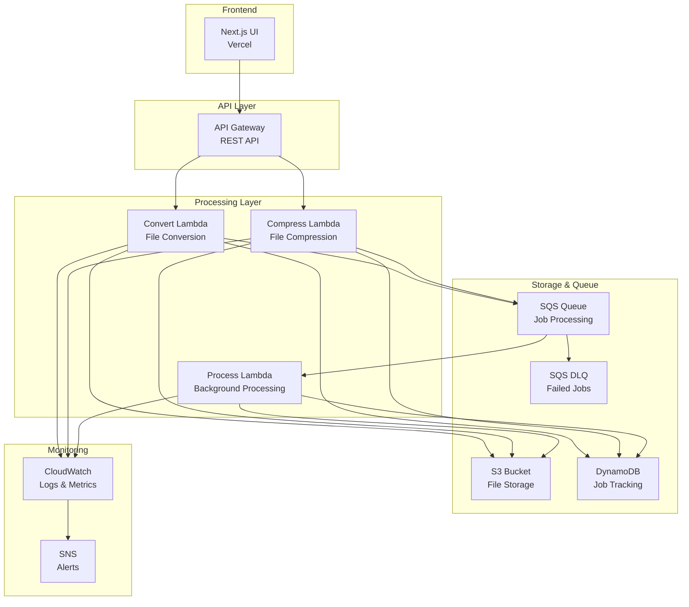

# Cloud Tools Terraform Infrastructure

This directory contains the complete Terraform infrastructure configuration for the Cloud Tools project, a serverless file processing application built on AWS.

## 📁 Project Structure

```
terraform/
├── README.md                    # This file - main documentation
├── main.tf                      # Main Terraform configuration
├── variables.tf                 # Global variables
├── outputs.tf                   # Global outputs
├── versions.tf                  # Provider and version constraints
├── modules/                     # Reusable Terraform modules
│   ├── s3/                     # S3 bucket for file storage
│   ├── dynamodb/               # DynamoDB table for job tracking
│   ├── sqs/                    # SQS queues for job processing
│   ├── lambda/                 # Lambda functions for processing
│   ├── api-gateway/            # API Gateway for REST endpoints
│   ├── cloudwatch/             # CloudWatch monitoring and logging
│   └── iam/                    # IAM roles and policies
├── environments/               # Environment-specific configurations
│   ├── dev/                    # Development environment
│   ├── staging/                # Staging environment (template)
│   └── production/             # Production environment
└── scripts/                    # Utility scripts
    └── deploy.sh              # Automated deployment script
```

## 🏗️ Architecture Overview

The infrastructure creates a complete serverless file processing pipeline:



## 🚀 Quick Start

### Prerequisites

1. **AWS CLI** configured with appropriate credentials
2. **Terraform** >= 1.0 installed
3. **Appropriate AWS permissions** (see [Permissions](#permissions) section)

### 1. Setup Backend Storage (One-time setup)

Before deploying, create the S3 bucket and DynamoDB table for Terraform state:

```bash
# For development
aws s3 mb s3://cloud-tools-terraform-state-dev
aws dynamodb create-table \
  --table-name cloud-tools-terraform-locks-dev \
  --attribute-definitions AttributeName=LockID,AttributeType=S \
  --key-schema AttributeName=LockID,KeyType=HASH \
  --provisioned-throughput ReadCapacityUnits=1,WriteCapacityUnits=1
```

### 2. Deploy Infrastructure

Use the provided deployment script for easy deployment:

```bash
# Navigate to terraform directory
cd terraform

# Deploy to development environment
./scripts/deploy.sh -e dev -a plan
./scripts/deploy.sh -e dev -a apply

# Deploy to production environment
./scripts/deploy.sh -e production -a plan
./scripts/deploy.sh -e production -a apply
```

### 3. Manual Deployment (Alternative)

```bash
# Navigate to environment directory
cd terraform/environments/dev

# Initialize Terraform
terraform init -backend-config=backend-dev.tfvars

# Plan the deployment
terraform plan -out=tfplan

# Apply the changes
terraform apply tfplan
```

## 📋 Modules Overview

### 🗄️ S3 Module (`modules/s3/`)

- **Purpose**: File storage for uploads and processed files
- **Features**:
  - Encryption at rest (AES256)
  - Versioning and lifecycle policies
  - Public access blocked
  - Intelligent tiering for cost optimization
  - Automatic cleanup of old files

### 🏪 DynamoDB Module (`modules/dynamodb/`)

- **Purpose**: Job tracking and metadata storage
- **Features**:
  - Pay-per-request billing (scalable)
  - Global secondary indexes for efficient querying
  - Point-in-time recovery (production)
  - Automatic TTL for cleanup
  - Backup configuration

### 📬 SQS Module (`modules/sqs/`)

- **Purpose**: Asynchronous job processing queue
- **Features**:
  - Dead letter queue for failed messages
  - Server-side encryption
  - Long polling for efficiency
  - Configurable visibility timeout

### ⚡ Lambda Module (`modules/lambda/`)

- **Purpose**: Serverless file processing functions
- **Source**: Uses the `@cloud-tools/lambda` monorepo workspace
- **Location**: `infrastructure/modules/lambda/src/` (TypeScript workspace)
- **Functions**:
  - `convert`: Handles file conversion requests
  - `compress`: Handles file compression requests
  - `process`: Background processing worker
- **Features**:
  - Full TypeScript integration with shared `lib/` code
  - Path aliases for clean imports (`@/lib/*`, `@/handlers/*`)
  - Automated build process with esbuild bundling
  - X-Ray tracing (production)
  - Dead letter queue integration
  - Environment-specific configuration

### 🌐 API Gateway Module (`modules/api-gateway/`)

- **Purpose**: RESTful API for frontend integration
- **Features**:
  - CORS configuration
  - Lambda proxy integration
  - CloudWatch logging
  - Regional endpoint

### 📊 CloudWatch Module (`modules/cloudwatch/`)

- **Purpose**: Monitoring, logging, and alerting
- **Features**:
  - CloudWatch dashboard
  - Lambda error and duration alarms
  - SNS topics for alerts
  - Log retention policies

### 🔐 IAM Module (`modules/iam/`)

- **Purpose**: Security and access management
- **Features**:
  - Least privilege principle
  - Lambda execution roles
  - Service-to-service permissions
  - API Gateway CloudWatch role

## 🌍 Environments

### Development (`environments/dev/`)

- **Purpose**: Development and testing
- **Cost-optimized**: Lower timeouts, reduced retention, basic monitoring
- **Security relaxed**: WAF disabled, localhost CORS

### Production (`environments/production/`)

- **Purpose**: Live production workloads
- **High availability**: Enhanced monitoring, alerting, backup
- **Security hardened**: WAF enabled, restrictive CORS

## 🔧 Configuration

### Global Variables (`variables.tf`)

| Variable                | Description              | Default     | Environment Override |
| ----------------------- | ------------------------ | ----------- | -------------------- |
| `environment`           | Environment name         | -           | ✅ Required          |
| `aws_region`            | AWS region               | `us-east-1` | ✅                   |
| `lambda_timeout`        | Lambda timeout (seconds) | `300`       | ✅                   |
| `lambda_memory_size`    | Lambda memory (MB)       | `1024`      | ✅                   |
| `log_retention_in_days` | Log retention period     | `14`        | ✅                   |
| `enable_waf`            | Enable WAF protection    | `true`      | ✅                   |

### Environment-Specific Overrides

Each environment can override global defaults. See `environments/*/main.tf` files.

## 📤 Outputs

After deployment, important outputs are displayed:

```bash
# Get all outputs
terraform output

# Get specific output
terraform output api_gateway_url
```

### Key Outputs

- `api_gateway_url`: API endpoint for frontend integration
- `s3_bucket_name`: Bucket name for file storage
- `dynamodb_table_name`: Table name for job tracking
- `sqs_queue_url`: Queue URL for job processing

## 🔒 Security

### IAM Permissions

The infrastructure follows the principle of least privilege:

- **Lambda functions**: Only access to required S3 buckets, DynamoDB tables, and SQS queues
- **API Gateway**: Only invoke permissions for Lambda functions
- **Cross-service**: Minimal permissions for service-to-service communication

### Data Protection

- **Encryption**: All data encrypted at rest and in transit
- **Network security**: VPC configuration for production (optional)
- **Access controls**: Public access blocked on S3 buckets

### Required AWS Permissions

Your AWS credentials need these permissions for deployment:

```json
{
  "Version": "2012-10-17",
  "Statement": [
    {
      "Effect": "Allow",
      "Action": [
        "s3:*",
        "dynamodb:*",
        "sqs:*",
        "lambda:*",
        "apigateway:*",
        "iam:*",
        "logs:*",
        "cloudwatch:*",
        "sns:*",
        "budgets:*"
      ],
      "Resource": "*"
    }
  ]
}
```

## 💰 Cost Management

### Cost Optimization Features

- **S3 Intelligent Tiering**: Automatic cost optimization
- **DynamoDB On-Demand**: Pay only for what you use
- **Lambda Right-sizing**: Environment-specific memory allocation
- **Log Retention**: Automatic cleanup of old logs

### Budget Monitoring

- **Development**: $10/month budget with 80% alert
- **Production**: $100/month budget with 50% and 80% alerts
- **Anomaly Detection**: Production cost anomaly detection

## 🔧 Deployment Script

The `scripts/deploy.sh` script provides convenient deployment automation:

```bash
# Usage
./scripts/deploy.sh -e <environment> -a <action> [options]

# Examples
./scripts/deploy.sh -e dev -a plan                    # Plan dev deployment
./scripts/deploy.sh -e production -a apply            # Apply production
./scripts/deploy.sh -e dev -a destroy -y              # Destroy dev (auto-approve)
./scripts/deploy.sh -e production -a validate         # Validate production config
```

### Script Features

- ✅ Prerequisite checking (Terraform, AWS CLI, credentials)
- ✅ Automatic backend configuration
- ✅ Environment validation
- ✅ Safety checks for destructive operations
- ✅ Colored output for better readability

## 🐛 Troubleshooting

### Common Issues

1. **Backend bucket doesn't exist**

   ```bash
   Error: Failed to get existing workspaces: S3 bucket does not exist
   ```

   **Solution**: Create the backend S3 bucket first (see setup instructions)

2. **DynamoDB table doesn't exist for locking**

   ```bash
   Error acquiring the state lock
   ```

   **Solution**: Create the DynamoDB table for state locking

3. **Insufficient permissions**

   ```bash
   Error: AccessDenied
   ```

   **Solution**: Ensure your AWS credentials have the required permissions

4. **Lambda ARN format issues**
   ```bash
   Error: Invalid function name
   ```
   **Solution**: Check that the Lambda ARN format is correct in API Gateway integration

### Debug Mode

Enable Terraform debug logging:

```bash
export TF_LOG=DEBUG
terraform plan
```

### State Management

If you need to manage Terraform state:

```bash
# List resources
terraform state list

# Show resource details
terraform state show aws_s3_bucket.main

# Remove resource from state (dangerous!)
terraform state rm aws_s3_bucket.main
```

## 📚 Additional Resources

- [AWS Lambda Best Practices](https://docs.aws.amazon.com/lambda/latest/dg/best-practices.html)
- [Terraform AWS Provider Documentation](https://registry.terraform.io/providers/hashicorp/aws/latest/docs)
- [API Gateway Developer Guide](https://docs.aws.amazon.com/apigateway/latest/developerguide/)
- [DynamoDB Best Practices](https://docs.aws.amazon.com/amazondynamodb/latest/developerguide/best-practices.html)

## 🤝 Contributing

1. Follow the existing module structure
2. Update documentation when adding features
3. Test changes in development environment first
4. Use meaningful commit messages
5. Add appropriate tags to resources

## 📝 License

This infrastructure configuration is part of the Cloud Tools project.
