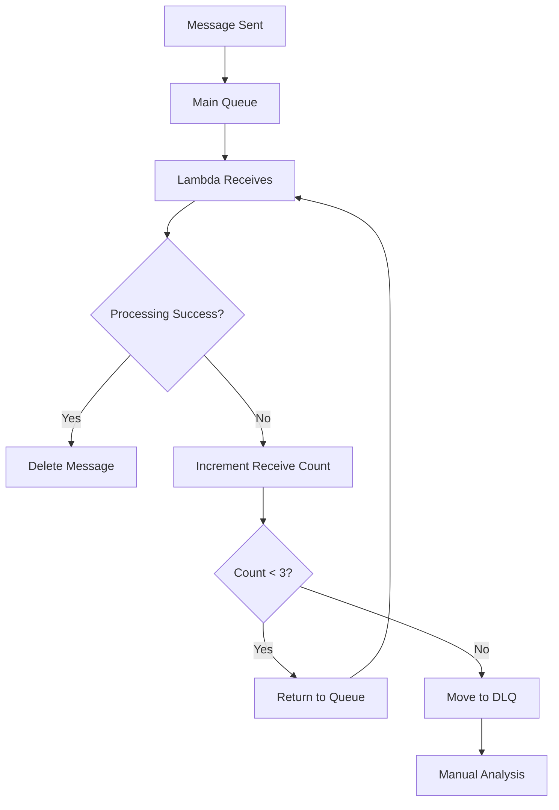

# SQS Module

This Terraform module creates Amazon Simple Queue Service (SQS) resources for the Cloud Tools project. It provides a main processing queue with a dead letter queue for failed messages, complete with security policies, encryption, and optimized configuration for asynchronous job processing.

## Features

- **Main Processing Queue**: High-performance queue for job processing
- **Dead Letter Queue**: Automatic handling of failed message processing
- **Security Policies**: Service-specific access controls for S3 and Lambda
- **Encryption**: Server-side encryption for message security
- **Long Polling**: Optimized for cost and performance
- **Configurable Settings**: Adjustable timeouts and retention periods
- **Error Handling**: Built-in retry mechanism with DLQ failover

## Resources Created

### SQS Queues

- `aws_sqs_queue.main` - Primary job processing queue
- `aws_sqs_queue.dead_letter` - Dead letter queue for failed messages

### Security and Access Control

- `aws_sqs_queue_policy.main` - Queue access policy for S3 and Lambda services

### Supporting Resources

- `data.aws_caller_identity.current` - Current AWS account information

## Usage

### Basic Usage

```hcl
module "sqs" {
  source = "./modules/sqs"

  project_name    = "cloud-tools"
  environment     = "production"
  resource_suffix = "abc123"

  tags = {
    Environment = "production"
    Owner       = "platform-team"
    Project     = "cloud-tools"
  }
}
```

### Advanced Configuration

```hcl
module "sqs" {
  source = "./modules/sqs"

  project_name    = "cloud-tools"
  environment     = "production"
  resource_suffix = "abc123"

  # Queue configuration
  queue_name                = "custom-processing-queue"
  visibility_timeout_seconds = 1800    # 30 minutes
  message_retention_seconds  = 604800  # 7 days

  # Resource tagging
  tags = {
    Environment   = "production"
    Owner         = "platform-team"
    Project       = "cloud-tools"
    CostCenter    = "engineering"
    QueueType     = "processing"
    Priority      = "high"
    ManagedBy     = "terraform"
  }
}
```

### Development Environment

```hcl
module "sqs_dev" {
  source = "./modules/sqs"

  project_name    = "cloud-tools"
  environment     = "development"
  resource_suffix = random_id.suffix.hex

  # Development-optimized settings
  queue_name                = "dev-jobs-queue"
  visibility_timeout_seconds = 300     # 5 minutes (shorter for dev)
  message_retention_seconds  = 345600  # 4 days (shorter retention)

  tags = {
    Environment = "development"
    Project     = "cloud-tools"
    Owner       = "dev-team"
    ManagedBy   = "terraform"
  }
}
```

## Variables

| Name                         | Description                                    | Type          | Default                    | Required |
| ---------------------------- | ---------------------------------------------- | ------------- | -------------------------- | :------: |
| `project_name`               | Name of the project                            | `string`      | n/a                        |   yes    |
| `environment`                | Environment name                               | `string`      | n/a                        |   yes    |
| `resource_suffix`            | Random suffix for resource naming              | `string`      | n/a                        |   yes    |
| `queue_name`                 | Name of the SQS queue                          | `string`      | `"cloud-tools-jobs-queue"` |    no    |
| `visibility_timeout_seconds` | Visibility timeout for SQS messages in seconds | `number`      | `900`                      |    no    |
| `message_retention_seconds`  | Message retention period in seconds            | `number`      | `1209600`                  |    no    |
| `tags`                       | Tags to apply to resources                     | `map(string)` | `{}`                       |    no    |

## Outputs

| Name                     | Description                   |
| ------------------------ | ----------------------------- |
| `queue_name`             | Name of the SQS queue         |
| `queue_id`               | ID of the SQS queue           |
| `queue_arn`              | ARN of the SQS queue          |
| `queue_url`              | URL of the SQS queue          |
| `dead_letter_queue_name` | Name of the dead letter queue |
| `dead_letter_queue_id`   | ID of the dead letter queue   |
| `dead_letter_queue_arn`  | ARN of the dead letter queue  |
| `dead_letter_queue_url`  | URL of the dead letter queue  |

## Queue Configuration

### Main Processing Queue

**Queue Settings**:

- **Visibility Timeout**: 15 minutes (900 seconds) - configurable
- **Message Retention**: 14 days (1209600 seconds) - configurable
- **Max Message Size**: 256 KB (262144 bytes)
- **Delay Seconds**: 0 (immediate delivery)
- **Receive Wait Time**: 20 seconds (long polling enabled)

**Dead Letter Queue Integration**:

- **Max Receive Count**: 3 attempts before moving to DLQ
- **Automatic Failover**: Failed messages automatically moved to DLQ

### Dead Letter Queue

**Purpose**: Handles messages that fail processing after maximum retry attempts

**Configuration**:

- Same retention and visibility timeout as main queue
- Server-side encryption enabled
- Isolated for analysis and reprocessing

## Security and Access Control

### Queue Access Policy

The module creates a comprehensive access policy with two main permissions:

#### S3 Service Access

```json
{
  "Sid": "AllowS3ToSendMessages",
  "Effect": "Allow",
  "Principal": {
    "Service": "s3.amazonaws.com"
  },
  "Action": "sqs:SendMessage",
  "Resource": "queue-arn",
  "Condition": {
    "StringEquals": {
      "aws:SourceAccount": "account-id"
    }
  }
}
```

**Purpose**: Allows S3 bucket events to send messages to the queue
**Security**: Restricted to same AWS account

#### Lambda Service Access

```json
{
  "Sid": "AllowLambdaToReceiveMessages",
  "Effect": "Allow",
  "Principal": {
    "Service": "lambda.amazonaws.com"
  },
  "Action": [
    "sqs:ReceiveMessage",
    "sqs:DeleteMessage",
    "sqs:GetQueueAttributes",
    "sqs:ChangeMessageVisibility"
  ],
  "Resource": "queue-arn"
}
```

**Purpose**: Allows Lambda functions to process messages from the queue
**Permissions**: Full message lifecycle management

### Encryption

**Type**: Server-Side Encryption (SSE) with SQS-managed keys
**Scope**: Applied to both main queue and dead letter queue
**Benefit**: Messages encrypted at rest without additional KMS costs

## Message Flow and Processing

### Standard Message Processing

1. **Message Arrival**: S3 events or direct sends add messages to main queue
2. **Lambda Processing**: Lambda functions poll and receive messages
3. **Visibility Timeout**: Messages become invisible during processing
4. **Success**: Messages deleted upon successful processing
5. **Failure**: Failed messages return to queue after visibility timeout

### Dead Letter Queue Flow

1. **Retry Logic**: Messages are retried up to 3 times
2. **DLQ Transfer**: After 3 failures, messages move to dead letter queue
3. **Analysis**: Failed messages can be inspected and analyzed
4. **Reprocessing**: Messages can be moved back to main queue if needed

### Message Lifecycle



## Performance Optimization

### Long Polling Configuration

- **Receive Wait Time**: 20 seconds
- **Benefits**: Reduces empty receives and costs
- **Impact**: More efficient polling, lower latency

### Visibility Timeout Settings

| Timeout     | Use Case                      | Benefits                 |
| ----------- | ----------------------------- | ------------------------ |
| 5 minutes   | Quick processing, development | Fast retry cycles        |
| 15 minutes  | Standard processing           | Balanced processing time |
| 30+ minutes | Long-running tasks            | Prevents premature retry |

### Message Batching

```python
# Example: Efficient message processing
import boto3

sqs = boto3.client('sqs')
queue_url = os.environ['SQS_QUEUE_URL']

# Receive multiple messages at once
response = sqs.receive_message(
    QueueUrl=queue_url,
    MaxNumberOfMessages=10,  # Process up to 10 messages
    WaitTimeSeconds=20       # Long polling
)

messages = response.get('Messages', [])
for message in messages:
    try:
        # Process message
        process_message(message)

        # Delete successful messages
        sqs.delete_message(
            QueueUrl=queue_url,
            ReceiptHandle=message['ReceiptHandle']
        )
    except Exception as e:
        # Let message return to queue for retry
        print(f"Processing failed: {e}")
```

## Integration Patterns

### S3 Event Integration

```hcl
# S3 bucket notification to SQS
resource "aws_s3_bucket_notification" "sqs" {
  bucket = module.s3.bucket_id

  queue {
    queue_arn     = module.sqs.queue_arn
    events        = ["s3:ObjectCreated:*"]
    filter_prefix = "uploads/"
    filter_suffix = ".pdf"
  }
}
```

### Lambda Event Source Mapping

```hcl
# Lambda function triggered by SQS
resource "aws_lambda_event_source_mapping" "sqs" {
  event_source_arn = module.sqs.queue_arn
  function_name    = module.lambda.process_function_name
  batch_size       = 5

  # Optional: Configure partial batch failure handling
  function_response_types = ["ReportBatchItemFailures"]
}
```

### API Gateway Integration

```python
# Send message via API Gateway
import boto3
import json

def lambda_handler(event, context):
    sqs = boto3.client('sqs')
    queue_url = os.environ['SQS_QUEUE_URL']

    message_body = {
        "jobId": event['body']['jobId'],
        "operation": event['body']['operation'],
        "timestamp": datetime.utcnow().isoformat()
    }

    response = sqs.send_message(
        QueueUrl=queue_url,
        MessageBody=json.dumps(message_body)
    )

    return {
        'statusCode': 200,
        'body': json.dumps({
            'message': 'Job queued successfully',
            'messageId': response['MessageId']
        })
    }
```

## Monitoring and Observability

### CloudWatch Metrics

**Available Metrics**:

- `NumberOfMessagesSent`: Messages added to queue
- `NumberOfMessagesReceived`: Messages retrieved from queue
- `NumberOfMessagesDeleted`: Successfully processed messages
- `ApproximateNumberOfMessages`: Current queue depth
- `ApproximateAgeOfOldestMessage`: Age of oldest unprocessed message

### Custom Monitoring

```python
# Example: Queue depth monitoring
import boto3

def monitor_queue_health():
    sqs = boto3.client('sqs')
    cloudwatch = boto3.client('cloudwatch')

    # Get queue attributes
    response = sqs.get_queue_attributes(
        QueueUrl=queue_url,
        AttributeNames=['ApproximateNumberOfMessages']
    )

    queue_depth = int(response['Attributes']['ApproximateNumberOfMessages'])

    # Send custom metric
    cloudwatch.put_metric_data(
        Namespace='Cloud-Tools/SQS',
        MetricData=[
            {
                'MetricName': 'QueueDepth',
                'Value': queue_depth,
                'Unit': 'Count'
            }
        ]
    )

    # Alert if queue depth is high
    if queue_depth > 100:
        print(f"WARNING: High queue depth: {queue_depth}")
```

### Integration with CloudWatch Module

```hcl
module "cloudwatch" {
  # ... other configuration
  sqs_queue_name = module.sqs.queue_name
}
```

## Cost Optimization

### Request Pricing

- **Standard Requests**: $0.40 per million requests (first 1M free)
- **Long Polling**: Reduces number of empty receives
- **Batch Operations**: Process multiple messages per request

### Data Transfer Costs

- **Within Region**: No charge for data transfer
- **Cross-Region**: Standard data transfer charges apply

### Retention Strategy

```hcl
# Cost vs. availability trade-off
module "sqs_cost_optimized" {
  message_retention_seconds = 345600  # 4 days vs. default 14 days
  visibility_timeout_seconds = 300    # 5 minutes vs. default 15 minutes
}
```

## Error Handling and Troubleshooting

### Common Issues

**Messages Not Being Processed**

```bash
# Check queue depth
aws sqs get-queue-attributes \
  --queue-url queue-url \
  --attribute-names ApproximateNumberOfMessages

# Check Lambda event source mapping
aws lambda list-event-source-mappings \
  --function-name function-name
```

**Messages Going to DLQ**

```bash
# Check DLQ for failed messages
aws sqs receive-message \
  --queue-url dlq-url \
  --max-number-of-messages 10

# Get message attributes for debugging
aws sqs receive-message \
  --queue-url dlq-url \
  --attribute-names All \
  --message-attribute-names All
```

**Permission Issues**

```bash
# Verify queue policy
aws sqs get-queue-attributes \
  --queue-url queue-url \
  --attribute-names Policy

# Test IAM permissions
aws iam simulate-principal-policy \
  --policy-source-arn role-arn \
  --action-names sqs:SendMessage \
  --resource-arns queue-arn
```

### Debug Tools

**Message Inspection**

```python
# Peek at messages without removing them
def peek_messages(queue_url, max_messages=10):
    sqs = boto3.client('sqs')

    response = sqs.receive_message(
        QueueUrl=queue_url,
        MaxNumberOfMessages=max_messages,
        VisibilityTimeoutSeconds=1  # Very short timeout
    )

    messages = response.get('Messages', [])
    for message in messages:
        print(f"MessageId: {message['MessageId']}")
        print(f"Body: {message['Body']}")
        print("---")

    return messages
```

**Queue Purging**

```python
# Clear all messages (use with caution)
def purge_queue(queue_url):
    sqs = boto3.client('sqs')

    response = sqs.purge_queue(QueueUrl=queue_url)
    print(f"Queue purged: {response}")
```

## Security Best Practices

### Access Control

1. **Principle of Least Privilege**: Only grant necessary permissions
2. **Service-Specific Access**: Use service principals instead of wildcard
3. **Account Boundaries**: Restrict access to same AWS account

### Message Security

1. **Encryption**: Always enable server-side encryption
2. **Sensitive Data**: Avoid putting secrets in message bodies
3. **Message Validation**: Validate message format and content

### Network Security

```hcl
# VPC Endpoint for private access (optional)
resource "aws_vpc_endpoint" "sqs" {
  vpc_id       = var.vpc_id
  service_name = "com.amazonaws.region.sqs"

  policy = jsonencode({
    Version = "2012-10-17"
    Statement = [
      {
        Effect = "Allow"
        Principal = "*"
        Action = [
          "sqs:SendMessage",
          "sqs:ReceiveMessage"
        ]
        Resource = module.sqs.queue_arn
      }
    ]
  })
}
```

## Migration and Updates

### Queue Configuration Changes

- **Visibility Timeout**: Can be updated without downtime
- **Message Retention**: Changes apply to new messages
- **Dead Letter Queue**: Can be modified or added to existing queues

### Queue Recreation

```bash
# Backup messages before recreation
aws sqs receive-message \
  --queue-url old-queue-url \
  --max-number-of-messages 10 > backup.json

# After recreation, restore if needed
aws sqs send-message-batch \
  --queue-url new-queue-url \
  --entries file://restore-entries.json
```

## Best Practices

### Message Design

```json
{
  "messageId": "unique-id",
  "timestamp": "2024-01-01T00:00:00Z",
  "operation": "convert",
  "payload": {
    "inputFile": "s3://bucket/path/file.pdf",
    "outputFormat": "png",
    "options": {
      "quality": "high",
      "resolution": "300dpi"
    }
  },
  "metadata": {
    "userId": "user123",
    "requestId": "req456"
  }
}
```

### Processing Patterns

1. **Idempotency**: Design processing to handle duplicate messages
2. **Batch Processing**: Process multiple messages when possible
3. **Graceful Degradation**: Handle partial failures appropriately
4. **Monitoring**: Track processing metrics and queue health

### Development Workflow

1. **Local Testing**: Use LocalStack or AWS CLI for development
2. **Environment Separation**: Use different queues for dev/staging/prod
3. **Message Replay**: Design systems to replay messages from DLQ
4. **Load Testing**: Test queue performance under expected load

## Examples

### Multi-Environment Setup

```hcl
# Development environment
module "sqs_dev" {
  source = "./modules/sqs"

  project_name    = "cloud-tools"
  environment     = "development"
  resource_suffix = "dev"

  # Development-specific settings
  visibility_timeout_seconds = 300     # 5 minutes
  message_retention_seconds  = 345600  # 4 days

  tags = {
    Environment = "development"
    CostOptimized = "true"
  }
}

# Production environment
module "sqs_prod" {
  source = "./modules/sqs"

  project_name    = "cloud-tools"
  environment     = "production"
  resource_suffix = "prod"

  # Production-specific settings
  visibility_timeout_seconds = 900      # 15 minutes
  message_retention_seconds  = 1209600  # 14 days

  tags = {
    Environment = "production"
    HighAvailability = "true"
  }
}
```

### Custom Queue Configuration

```hcl
# High-throughput processing queue
module "sqs_high_throughput" {
  source = "./modules/sqs"

  project_name    = "cloud-tools"
  environment     = "production"
  resource_suffix = "ht"

  queue_name = "high-throughput-jobs"
  visibility_timeout_seconds = 60   # Short timeout for quick processing
  message_retention_seconds  = 86400 # 1 day retention

  tags = {
    QueueType = "high-throughput"
    Priority  = "realtime"
  }
}
```
